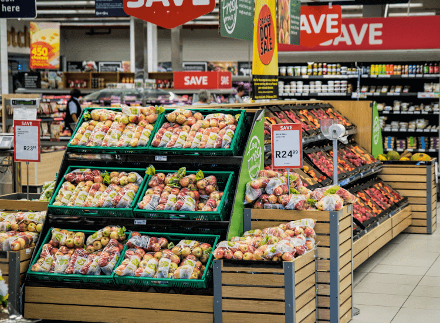

# Grocery Store Sales Analysis

# Introduction
The aim of the project was to demostrate my skills in modelling, visualization and generating insights and recommendation from a dataset, with user friendly navigation across the different report pages.
1. Overview
2. Sales Report
3. Profit Report
4. Insights

## Problem Statement
A fictional grocery chain is doing their annual sales review of the last fiscal year, which is 2018. The stakeholders wish to know if the sales and marketing efforts launched for the previous year had been a success with respect to sales and profits, and they would like to know hich of the products in inventory had performed well. The task was handed over to data analyt Chukwujekwu to delve into the available dataset, containg sales records from the year 2015-2018 to answer their questions.

After thinking deeply, the following questions were decided as the best path to answer the stakeholders questions.

* What is the Year over Year performance of the franchise with respect to sales
* what product is generating the most sales with respect to the year under review
* What is the profit margin of sales recorded
* Which product generates the most profits and what is it's profit margin
 

The dataset was provided during the DBrown Consulting data modelling conference, for an analysis of a fictional grocery store chain domiciled in the indian state of Tamil Nadu, containing sales records of it's branches in various cities in the state.
