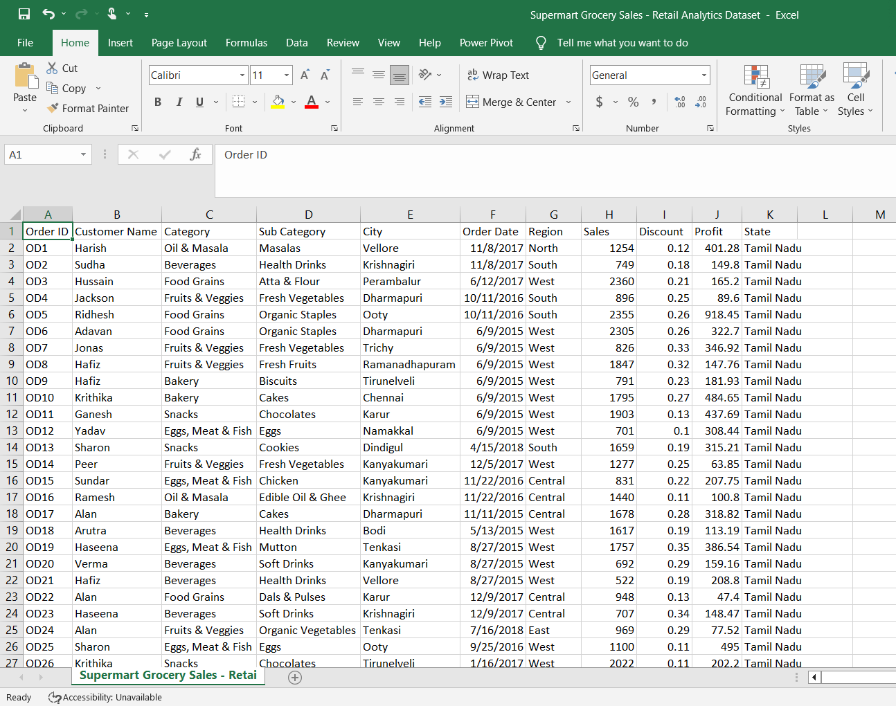
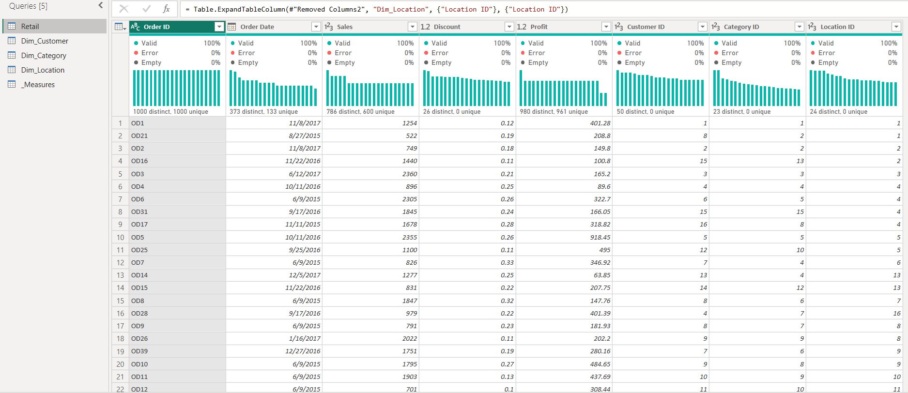
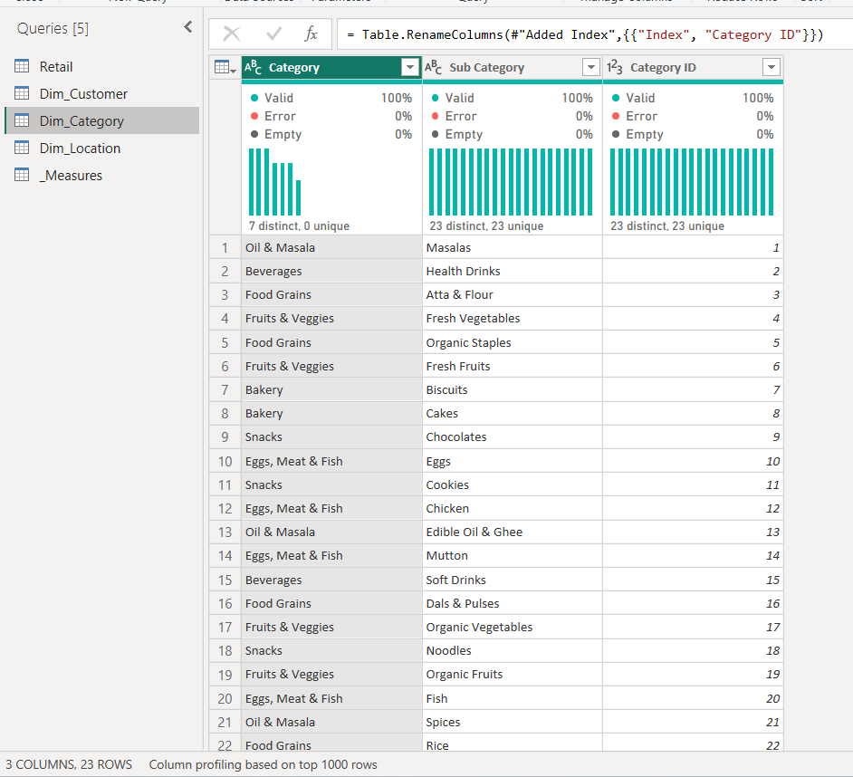
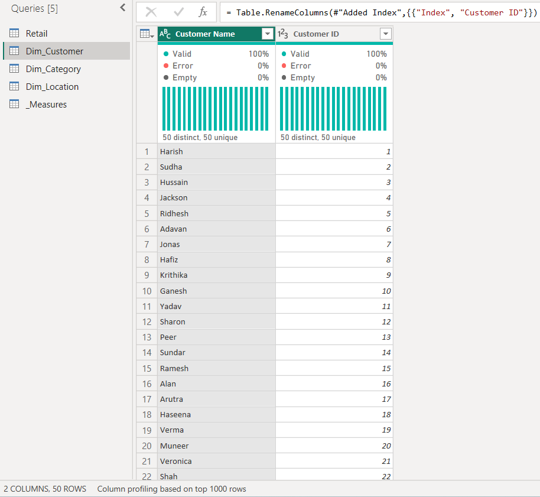
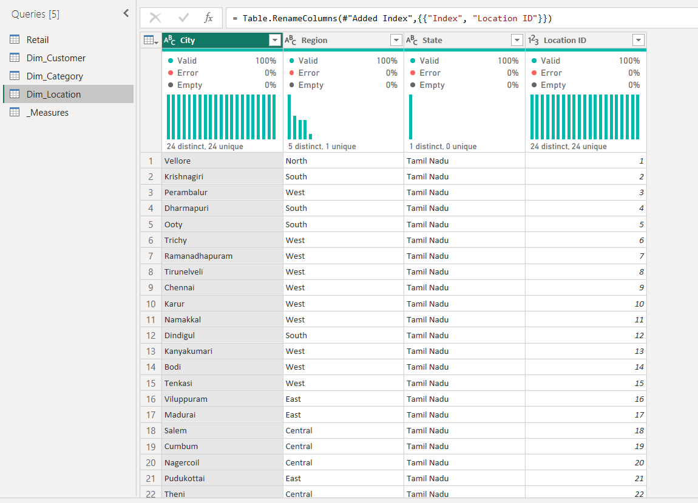
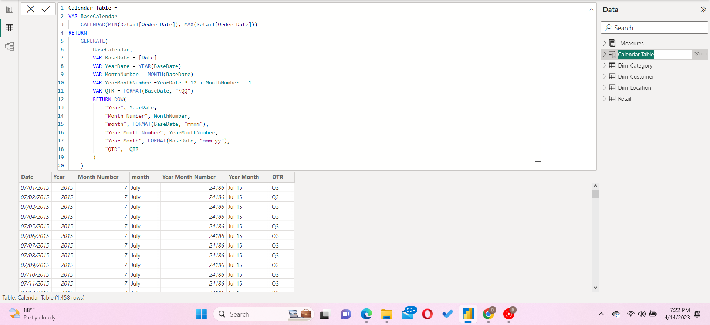
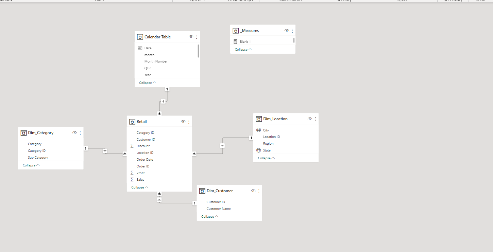
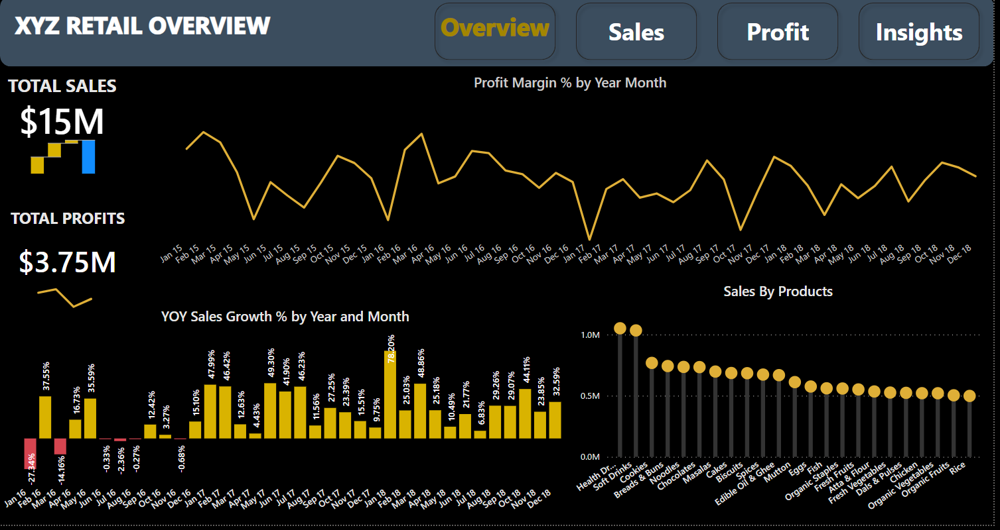
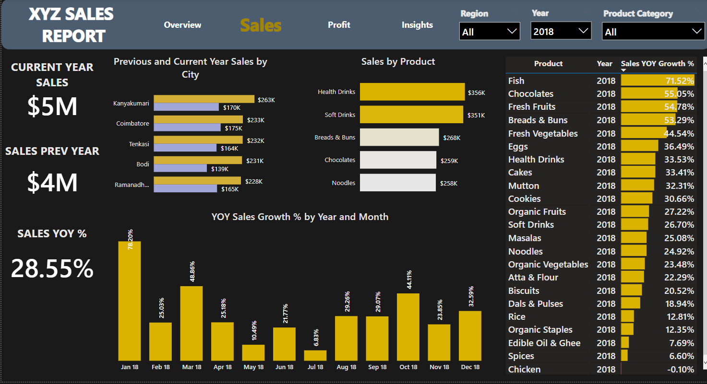
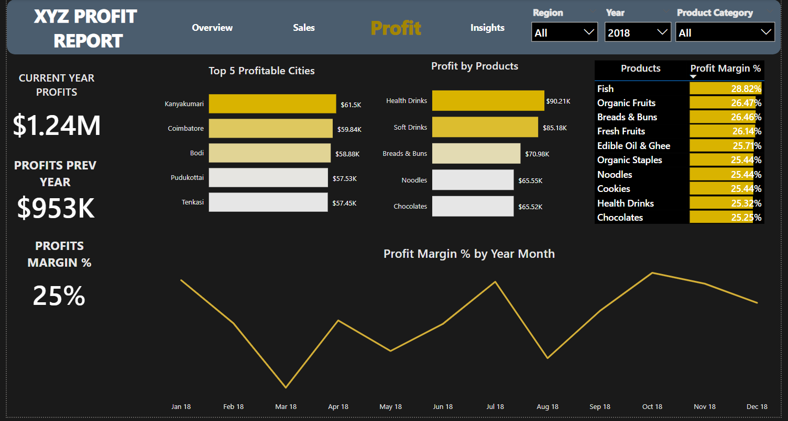

# Grocery Store Sales Analysis

# Introduction
The aim of the project was to demostrate my skills in modelling, visualization and generating insights and recommendation from a dataset, with user friendly navigation across the different report pages.
1. Overview
2. Sales Report
3. Profit Report
4. Insights

## Problem Statement

A fictional grocery chain is doing their annual sales review of the last fiscal year, which is 2018. The stakeholders wish to know if the sales and marketing efforts launched for the previous year had been a success with respect to sales and profits, and they would like to know hich of the products in inventory had performed well. The task was handed over to data analyt Chukwujekwu to delve into the available dataset, containg sales records from the year 2015-2018 to answer their questions.

After thinking deeply, the following questions were decided as the best path to answer the stakeholders questions.

* What is the Year over Year performance of the franchise with respect to sales
* what product is generating the most sales with respect to the year under review
* What is the profit margin of sales recorded
* Which product generates the most profits and what is it's profit margin
* Which city is the business generating the most sales and is the same true for profits.

The dataset is a CSV file saved locally in a folder. the file is [denormalized](Retail_Analytics.csv) in a single table.

**Power BI Concepts Applied**

* Dax concepts - Calculated columns, calculated measures, calculated date columns , YOY calculations
* Star schema

## Data Sourcing

The dataset was provided during the DBrown Consulting data modelling conference, for an analysis of a fictional grocery store chain domiciled in the indian state of Tamil Nadu, containing sales records of it's branches in various cities in the state.
The dataset consist of 9,995 rows and 11 columns, which was downloaded into power BI for cleaning and further analysis.

## Data Transformation

The dataset contained no errors and was found to be clean, it was normalized to form a single fact table and 3 dimension tables.

Retail sales fact table | Category dimension table
----------------------- | ------------------------
|

Customer dimension table | Location dimension table
-----------------------  | -----------------------
|

A date table titled calendar table was created to house date segements in it's columns
the columns include: 
* year
* year month
* year month number
* quaters
* month
* month number

Date table|
--------- |
|

## Data Modelling
Data modelling was conducted to create primary keys in the dimensions tables for ease of connection with the fact table
the following columns acted as the primary keys :
* category ID
* customer ID
* location ID
* date column
the automatic connections were checked for connection issues, none was found as they were all properly connected

Data Model Star Schema|
-------------------  |
|

## Analysis and Visualization
The full report is available [here](https://app.powerbi.com/view?r=eyJrIjoiMWE4OWYwNWUtZDhmNC00MWMxLThhMGYtMzNiOTgyMzUzNGQ1IiwidCI6ImNmNGQxZDUxLWEzMjQtNDhmNC1iNTc5LTIwOGIyZDQ5MzAwZiJ9)

Report Overview|
-------------  |
|

Sales Report|
-------------  |
|

Profit Report|
-------------  |
|

## Insights and Recommendation

**Insights**
* The current year 2018 has been noted to be the company's most successful year yet, pulling 50% of the total cumulative sales of previous years.
* Health drinks and soft drinks which accounted for the most sales across all the years retained their spot as the company's highest selling and  most profitable products.
* The city of Kanyakumari generated the most profit for the year 2018 leaping from its fourth profitable spot in the previous year.
* It was noticed that the company's profits peaked in 2016, and dropped significantly in 2017 before rising in 2018.
* Fish sales accounted for products where we noticed the highest profit margin with almost 2% highest than the inventory average of 27%

**Recommendation**

* An increase in marketing and investment in Fish product for the coming year.
* Sales approach and strategy of our store in the city of Kanyakumari should be employed in our other stores.
* An expansion of the existing store in Kanyakumari, or opening of more branches in said city.
* Marketing and sales strategy used for Health and Soft drinks should be applied to other products.
